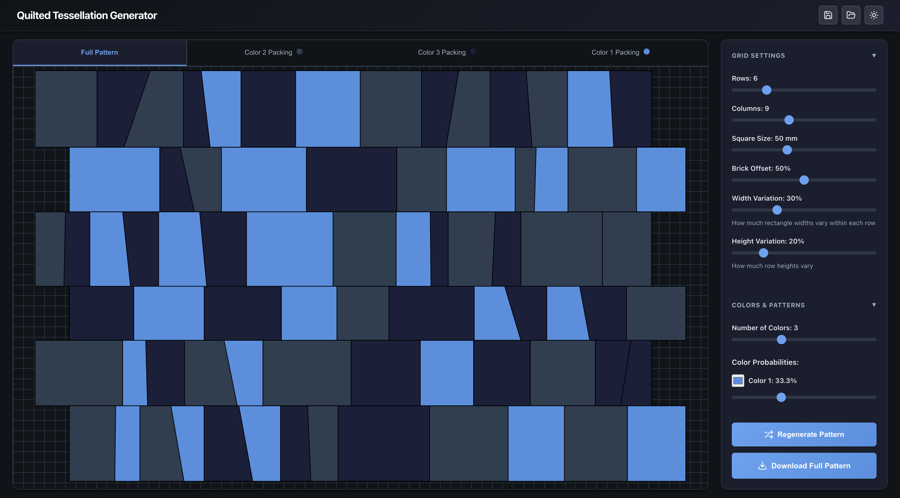

# Quilt Tessellator

Generate custom tessellation patterns for laser-cut quilted garments. Design multi-color brick-pattern layouts, export SVGs per fabric color, and pack pieces efficiently onto sheets.



**[Live Demo →](https://zacharyfmarion.github.io/quilt-tessalator/)**

## Features

- **Variable brick-pattern tessellation** with configurable grid, offsets, and random variation
- **Multi-color support** (2-5 colors) with intelligent adjacency control and weighted probabilities
- **Flexible piece splitting** into triangles or angled quadrilaterals
- **Seam allowance** built into all pieces (default 1/4" / 6.35mm)
- **Per-color SVG export** optimized for laser cutting
- **Automated nesting** to pack pieces efficiently onto fabric sheets
- **Save/load projects** as JSON files

## Development

```bash
pnpm install    # Install dependencies
pnpm dev        # Start dev server (http://localhost:5173)
pnpm build      # Build for production
```

## Workflow

1. **Design** your pattern using the grid settings and color controls
2. **Preview** the full tessellation in the main view
3. **Pack** each color using the packing tabs to optimize fabric usage
4. **Export** SVGs by color for laser cutting
5. **Cut** each fabric color separately on your laser cutter
6. **Sew** pieces together following the pattern reference

## License

MIT
